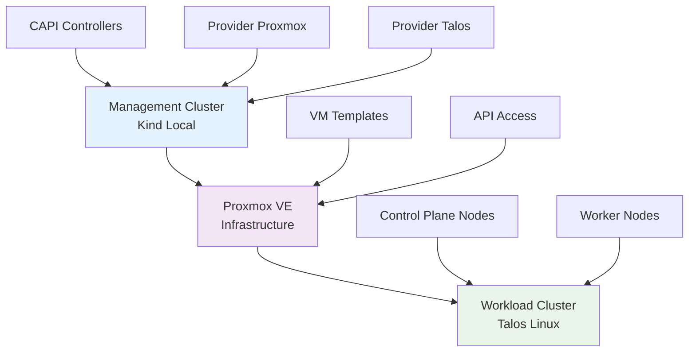

# Deploy Kubernetes con Cluster API
## Gestione Automatizzata dei Cluster

**Dal Chaos all'Automazione**

<div class="pt-12">
  <span @click="$slidev.nav.next" class="px-2 py-1 rounded cursor-pointer" hover="bg-white bg-opacity-10">
    Press Space for next page <carbon:arrow-right class="inline"/>
  </span>
</div>

---
transition: fade-out
---

# Il Problema della Gestione Manuale

<div class="grid grid-cols-2 gap-4">

<div>

## Sfide Operative Attuali

- **Script personalizzati** per provisioning
- **Procedure manuali** per upgrade
- **Configurazioni statiche** difficili da versionare
- **Approcci imperativi** vs dichiarativi

</div>

<div>

## Problemi Concreti

- **Error-prone operations** - ogni step può fallire
- **Configuration drift** - cluster "snowflake"
- **Scalabilità limitata** - carico operativo lineare
- **Complessità crescente** - gestione multi-cluster

</div>

</div>

<div class="mt-8 p-4 bg-red-100 rounded-lg">
<carbon:warning class="inline text-red-600"/> <strong>Secondo le survey CNCF</strong>, la complessità operativa è una delle principali sfide nell'adozione enterprise di Kubernetes
</div>

---

# Script Tradizionale vs CAPI

<div class="grid grid-cols-2 gap-8">

<div>

## Approccio Tradizionale

```bash {all|1-3|4-7|8-12|13-15}
#!/bin/bash
# Script per aggiungere worker node
ssh worker-node-03

curl -s https://packages.cloud.google.com/apt/doc/apt-key.gpg | apt-key add -
echo "deb https://apt.kubernetes.io/ kubernetes-xenial main" > /etc/apt/sources.list.d/kubernetes.list
apt-get update && apt-get install -y kubelet kubeadm kubectl

systemctl enable kubelet
swapoff -a
# ... configurazione runtime container
# ... configurazione networking

# ... join del cluster
```

<div class="text-red-600 text-sm mt-2">
❌ Error-prone, time-consuming, non riproducibile
</div>

</div>

<div>

## Approccio CAPI

```yaml {all|1-6|7-12|13-17}
apiVersion: cluster.x-k8s.io/v1beta1
kind: Cluster
metadata:
  name: production-cluster
spec:
  controlPlaneRef:
    apiVersion: controlplane.cluster.x-k8s.io/v1beta1
    kind: KubeadmControlPlane
    name: production-control-plane
  infrastructureRef:
    apiVersion: infrastructure.cluster.x-k8s.io/v1beta1
    kind: ProxmoxCluster
    name: production-proxmox
```

```bash
kubectl apply -f cluster.yaml
```

<div class="text-green-600 text-sm mt-2">
✅ Dichiarativo, idempotente, versionabile
</div>

</div>

</div>

---
layout: center
class: text-center
---

# Che cos'è Cluster API?

<div class="text-6xl text-blue-600 mb-8">
<carbon:kubernetes />
</div>

**Sub-progetto ufficiale di Kubernetes** per la gestione dichiarativa dell'intero ciclo di vita di cluster Kubernetes

<div class="grid grid-cols-3 gap-8 mt-12">

<div class="p-6 bg-blue-50 rounded-lg">
<carbon:api class="text-3xl text-blue-600 mb-4"/>
<h3 class="font-bold">API Dichiarative</h3>
<p class="text-sm">Definisci lo stato desiderato, CAPI si occupa del "come"</p>
</div>

<div class="p-6 bg-green-50 rounded-lg">
<carbon:recycle class="text-3xl text-green-600 mb-4"/>
<h3 class="font-bold">Eventual Consistency</h3>
<p class="text-sm">Controller che riconciliano continuamente lo stato</p>
</div>

<div class="p-6 bg-purple-50 rounded-lg">
<carbon:container-services class="text-3xl text-purple-600 mb-4"/>
<h3 class="font-bold">Provider Pattern</h3>
<p class="text-sm">Astrazione dell'infrastruttura sottostante</p>
</div>

</div>

---

# Architettura CAPI: Management vs Workload

<div class="grid grid-cols-2 gap-8">

<div>

## Management Cluster
<div class="p-4 bg-blue-50 rounded-lg mb-4">
<carbon:cloud-services class="inline text-blue-600"/> **Hub di controllo centrale**
</div>

- Hosting dei controller CAPI core
- Archiviazione delle CRD
- Orchestrazione ciclo di vita
- Gestione credenziali

<div class="mt-4 p-3 bg-gray-100 rounded">
<strong>Può essere:</strong><br>
• Cluster locale (kind)<br>
• Cluster dedicato<br>
• Multi-tenant setup
</div>

</div>

<div>

## Workload Cluster
<div class="p-4 bg-green-50 rounded-lg mb-4">
<carbon:deploy class="inline text-green-600"/> **Cluster per le applicazioni**
</div>

- Deployment delle applicazioni business
- Lifecycle completamente gestito
- Isolamento operativo
- Scaling automatico

<div class="mt-4 p-3 bg-gray-100 rounded">
<strong>Caratteristiche:</strong><br>
• Gestione dichiarativa<br>
• Zero-touch operations<br>
• Self-healing infrastructure
</div>

</div>

</div>

<div class="mt-8 text-center">
<div class="inline-flex items-center space-x-4 p-4 bg-yellow-50 rounded-lg">
<carbon:connection-signal class="text-2xl text-yellow-600"/>
<span class="font-semibold">Un Management Cluster può gestire centinaia di Workload Cluster</span>
</div>
</div>

---

# Componenti Core di CAPI

<div class="grid grid-cols-2 gap-6">

<div>

## Core Controller
```yaml
apiVersion: cluster.x-k8s.io/v1beta1
kind: Cluster
metadata:
  name: production-cluster
spec:
  controlPlaneRef:
    kind: TalosControlPlane
    name: production-control-plane
  infrastructureRef:
    kind: ProxmoxCluster 
    name: production-proxmox
```

<div class="text-sm text-gray-600 mt-2">
Orchestrazione di alto livello del ciclo di vita
</div>

</div>

<div>

## Machine Controller
```yaml
apiVersion: cluster.x-k8s.io/v1beta1
kind: Machine
metadata:
  name: worker-node-01
spec:
  version: "v1.29.0"
  bootstrap:
    configRef:
      kind: TalosConfig
      name: worker-bootstrap-config
```

<div class="text-sm text-gray-600 mt-2">
Gestione singole istanze di calcolo
</div>

</div>

</div>

<div class="grid grid-cols-3 gap-4 mt-8">

<div class="p-4 bg-orange-50 rounded-lg text-center">
<carbon:settings class="text-2xl text-orange-600 mb-2"/>
<h4 class="font-bold">Bootstrap Provider</h4>
<p class="text-sm">Configurazione iniziale nodi</p>
</div>

<div class="p-4 bg-indigo-50 rounded-lg text-center">
<!-- <carbon:server-dns class="text-2xl text-indigo-600 mb-2"/> -->
<h4 class="font-bold">Control Plane Provider</h4>
<p class="text-sm">Gestione componenti master</p>
</div>

<div class="p-4 bg-teal-50 rounded-lg text-center">
<carbon:cloud-foundry class="text-2xl text-teal-600 mb-2"/>
<h4 class="font-bold">Infrastructure Provider</h4>
<p class="text-sm">Astrazione infrastruttura</p>
</div>

</div>

---

# Reconciliation Loop: La Magia Dietro CAPI

<div class="text-center mb-8">


</div>

<div class="grid grid-cols-2 gap-8">

<div>

## Algoritmo di Reconciliation

```go {all|3-6|8-12|14-16}
func (r *Reconciler) Reconcile(ctx context.Context, 
    req ctrl.Request) (ctrl.Result, error) {
    // 1. Observe - Fetch current state
    obj := &v1beta1.Object{}
    if err := r.Get(ctx, req.NamespacedName, obj); 
        err != nil {
        return ctrl.Result{}, 
               client.IgnoreNotFound(err)
    }
    
    // 2. Analyze - Compare desired vs actual
    if obj.DeletionTimestamp != nil {
        return r.reconcileDelete(ctx, obj)
    }
    
    // 3. Act - Take corrective action
    return r.reconcileNormal(ctx, obj)
}
```

</div>

<div>

## Principi Fondamentali

<div class="space-y-4">

<div class="p-3 bg-blue-50 rounded">
<carbon:renew class="inline text-blue-600"/> **Idempotenza**<br>
<span class="text-sm">Operazioni sicure ripetibili</span>
</div>

<div class="p-3 bg-green-50 rounded">
<carbon:timer class="inline text-green-600"/> **Eventual Consistency**<br>
<span class="text-sm">Convergenza verso stato desiderato</span>
</div>

<div class="p-3 bg-purple-50 rounded">
<carbon:error class="inline text-purple-600"/> **Error Handling**<br>
<span class="text-sm">Retry automatici con backoff</span>
</div>

<div class="p-3 bg-orange-50 rounded">
<carbon:analytics class="inline text-orange-600"/> **Observability**<br>
<span class="text-sm">Eventi e metriche per debugging</span>
</div>

</div>

</div>

</div>

---
layout: center
class: text-center
---

# Talos Linux
## Il Sistema Operativo per Kubernetes

<div class="text-6xl text-orange-600 mb-8">
<carbon:bare-metal-server />
</div>

**OS Immutabile API-First progettato esclusivamente per Kubernetes**

<div class="grid grid-cols-4 gap-6 mt-12">

<div class="p-4 bg-red-50 rounded-lg">
<carbon:locked class="text-2xl text-red-600 mb-2"/>
<h4 class="font-bold text-sm">No SSH</h4>
<p class="text-xs">API-only management</p>
</div>

<div class="p-4 bg-blue-50 rounded-lg">
<carbon:security class="text-2xl text-blue-600 mb-2"/>
<h4 class="font-bold text-sm">Read-Only Root</h4>
<p class="text-xs">Filesystem immutabile</p>
</div>

<div class="p-4 bg-green-50 rounded-lg">
<carbon:minimize class="text-2xl text-green-600 mb-2"/>
<h4 class="font-bold text-sm">Minimal Attack Surface</h4>
<p class="text-xs">Solo componenti essenziali</p>
</div>

<div class="p-4 bg-purple-50 rounded-lg">
<carbon:automatic class="text-2xl text-purple-600 mb-2"/>
<h4 class="font-bold text-sm">Atomic Updates</h4>
<p class="text-xs">Upgrade senza downtime</p>
</div>

</div>

---

# Problemi OS Tradizionali vs Talos

<div class="grid grid-cols-2 gap-8">

<div>

## Sistema Tradizionale (Ubuntu)

```bash {all|1-3|5-7|9-12}
# Scenario tipico
ssh worker-node-01
sudo apt update && sudo apt upgrade -y

# Un mese dopo...
ssh worker-node-02  
sudo apt update && sudo apt upgrade -y

# Risultato: versioni diverse, 
# configurazioni divergenti,
# comportamenti inconsistenti
```

<div class="mt-4 p-3 bg-red-50 rounded">
<carbon:warning class="inline text-red-600"/> **Problemi:**
<ul class="text-sm mt-2">
<li>~1847 pacchetti installati (necessari &lt;20)</li>
<li>~50+ servizi in esecuzione</li>
<li>SSH access per manutenzione</li>
<li>Configuration drift inevitabile</li>
</ul>
</div>

</div>

<div>

## Talos Linux

```bash {all|1-3|5-7|9-11}
# Gestione via API
talosctl -n 192.168.1.100 get members
talosctl -n 192.168.1.100 logs kubelet

# Upgrade atomico
talosctl -n 192.168.1.100 upgrade \
  --image ghcr.io/siderolabs/installer:v1.7.1

# Configurazione immutabile
talosctl -n node-a,node-b get kubeletconfig
# Output identico su tutti i nodi
```

<div class="mt-4 p-3 bg-green-50 rounded">
<carbon:checkmark class="inline text-green-600"/> **Vantaggi:**
<ul class="text-sm mt-2">
<li>Solo componenti essenziali per K8s</li>
<li>Nessun accesso shell o SSH</li>
<li>Filesystem root read-only</li>
<li>Zero configuration drift</li>
</ul>
</div>

</div>

</div>

---

# Architettura Talos

<div class="grid grid-cols-2 gap-8">

<div>

## Filesystem Structure

```
/
├── boot/          # Boot partition (read-only)
├── system/        # System partition (read-only, squashfs)
├── var/           # Persistent data (writable)
│   ├── lib/kubernetes/
│   ├── lib/containerd/
│   └── log/
└── tmp/           # Temporary files (tmpfs)
```

<div class="p-3 bg-blue-50 rounded mt-4">
<carbon:locked class="inline text-blue-600"/> **Immutabilità garantita**: Il sistema base non può essere modificato runtime
</div>

</div>

<div>

## Componenti Essenziali

<div class="space-y-3">

<div class="p-2 bg-gray-100 rounded text-sm">
<carbon:chip class="inline"/> **Kernel Linux** ottimizzato
</div>

<div class="p-2 bg-gray-100 rounded text-sm">
<carbon:settings class="inline"/> **systemd** per service management
</div>

<div class="p-2 bg-gray-100 rounded text-sm">
<carbon:container-services class="inline"/> **containerd** + **runc**
</div>

<div class="p-2 bg-gray-100 rounded text-sm">
<carbon:network-3 class="inline"/> **CNI plugins** per networking
</div>

<div class="p-2 bg-gray-100 rounded text-sm">
<carbon:kubernetes class="inline"/> **kubelet** per K8s integration
</div>

</div>

<div class="p-3 bg-red-50 rounded mt-4">
<carbon:close class="inline text-red-600"/> **Esclusi**: shell, package manager, SSH, utility non essenziali
</div>

</div>

</div>

---

# Integrazione Talos + CAPI

<div class="grid grid-cols-2 gap-8">

<div>

## TalosConfig CRD

```yaml {all|1-6|7-11|12-20}
apiVersion: bootstrap.cluster.x-k8s.io/v1alpha3
kind: TalosConfig
metadata:
  name: worker-node-bootstrap
spec:
  generateType: "join"
  talosVersion: "v1.7.0"
  configPatches:
    - op: "add"
      path: "/machine/install"
      value:
        disk: "/dev/sda"
        image: "ghcr.io/siderolabs/installer:v1.7.0"
        wipe: false
    - op: "add"  
      path: "/machine/network/interfaces"
      value:
        - interface: "eth0"
          dhcp: true
```

</div>

<div>

## TalosControlPlane CRD

```yaml {all|1-8|9-14|15-22}
apiVersion: controlplane.cluster.x-k8s.io/v1alpha3
kind: TalosControlPlane
metadata:
  name: cluster-control-plane
spec:
  replicas: 3
  version: "v1.29.0"
  infrastructureTemplate:
    apiVersion: infrastructure.cluster.x-k8s.io/v1beta1
    kind: ProxmoxMachineTemplate
    name: control-plane-template
  controlPlaneConfig:
    controlplane:
      configPatches:
        - op: "add"
          path: "/cluster/etcd"
          value:
            ca:
              crt: LS0tLS1CRUdJTi0tLS0t...
              key: LS0tLS1CRUdJTi0tLS0t...
```

</div>

</div>

<div class="mt-6 p-4 bg-yellow-50 rounded-lg">
<carbon:idea class="inline text-yellow-600"/> **Vantaggi vs cloud-init**: Type safety, immutabilità, consistenza, sicurezza
</div>

---
layout: center
class: text-center
---

# Implementazione Pratica
## Setup con Proxmox

<div class="text-6xl text-green-600 mb-8">
<carbon:bare-metal-server-02 />
</div>

**Dalla teoria alla pratica: deploy del primo cluster**

---

# Architettura Target

<div class="text-center mb-8">



</div>

<div class="grid grid-cols-3 gap-6">

<div class="p-4 bg-blue-50 rounded-lg text-center">
<carbon:cloud-services class="text-2xl text-blue-600 mb-2"/>
<h4 class="font-bold">Management</h4>
<p class="text-sm">Kind cluster locale con controller CAPI</p>
</div>

<div class="p-4 bg-purple-50 rounded-lg text-center">
<carbon:server class="text-2xl text-purple-600 mb-2"/>
<h4 class="font-bold">Infrastructure</h4>
<p class="text-sm">Proxmox provider per gestione VM</p>
</div>

<div class="p-4 bg-green-50 rounded-lg text-center">
<carbon:kubernetes class="text-2xl text-green-600 mb-2"/>
<h4 class="font-bold">Workload</h4>
<p class="text-sm">Cluster Kubernetes production-ready</p>
</div>

</div>

---

# Setup Proxmox: Configurazione API

<div class="grid grid-cols-2 gap-8">

<div>

## Creazione User e Token

```bash {all|2-3|5-6|8-9}
# Creazione utente CAPI
pveum user add capi@pve \
  --comment "Cluster API Automation User"

# Assignment ruolo Administrator
pveum aclmod / -user capi@pve -role Administrator

# Generazione API token
pveum user token add capi@pve capi-token --privsep 0
```

<div class="mt-4 p-3 bg-green-50 rounded">
<carbon:checkmark class="inline text-green-600"/> **Output atteso:**
<pre class="text-xs mt-2">
full-tokenid: capi@pve!capi-token
value: 12345678-1234-1234-1234-123456789abc
</pre>
</div>

</div>

<div>

## Template Talos

```bash {all|2-4|6-15|17-18}
# Download ISO con estensioni Proxmox
wget https://factory.talos.dev/image/\
ce4c980550dd2ab1b17bbf2b08801c7eb59418eafe8f279833297925d67c7515/\
v1.10.5/nocloud-amd64.iso

# Creazione template VM
qm create 8700 \
  --name "talos-template" \
  --memory 2048 --cores 2 \
  --net0 virtio,bridge=vmbr0 \
  --scsi0 local-lvm:20,format=qcow2 \
  --ide2 local:iso/nocloud-amd64.iso,media=cdrom \
  --boot order=ide2 \
  --agent enabled=1,fstrim_cloned_disks=1

# Conversione a template
qm template 8700
```

</div>

</div>

<div class="mt-6 p-4 bg-yellow-50 rounded-lg">
<carbon:information class="inline text-yellow-600"/> **Fondamentale**: Usare ISO "no-cloud" con supporto cloud-init e QEMU Guest Agent
</div>

---

# Management Cluster Setup

<div class="grid grid-cols-2 gap-8">

<div>

## Kind Cluster

```yaml {all|1-5|6-15|16-20}
# kind-config.yaml
kind: Cluster
apiVersion: kind.x-k8s.io/v1alpha4
name: capi-management
nodes:
- role: control-plane
  kubeadmConfigPatches:
  - |
    kind: InitConfiguration
    nodeRegistration:
      kubeletExtraArgs:
        node-labels: "node-role.kubernetes.io/management=true"
  extraPortMappings:
  # Expose CAPI webhook ports
  - containerPort: 9443
    hostPort: 9443
    protocol: TCP
```

```bash
kind create cluster --config kind-config.yaml
```

</div>

<div>

## CAPI Initialization

```bash {all|1-6|8-12|14-16}
# Installazione clusterctl
curl -L https://github.com/kubernetes-sigs/cluster-api/releases/download/v1.10.3/clusterctl-linux-amd64 -o clusterctl
sudo install -o root -g root -m 0755 clusterctl /usr/local/bin/clusterctl

# Environment variables
export PROXMOX_URL="https://192.168.0.10:8006/api2/json"
export PROXMOX_TOKEN="capi@pve!capi-token"
export PROXMOX_SECRET="12345678-1234-1234-1234-123456789abc"

# Inizializzazione provider
clusterctl init \
  --infrastructure proxmox \
  --control-plane talos \
  --bootstrap talos

# Verifica installazione
kubectl get providers -A
```

</div>

</div>

---

# Python Generator: Automazione Template

<div class="grid grid-cols-2 gap-8">

<div>

## Architettura Generator


<div class="mt-4">

**Vantaggi:**
- **Parametrico**: configurazioni riutilizzabili
- **Templating**: logica condizionale
- **Validation**: controlli pre-deployment
- **Version control**: configurazioni versionabili

</div>

</div>

<div>

## Configurazione Default

```yaml {all|1-3|4-7|8-12|13-17}
# homelab.yaml
cluster_name: "homelab-cluster"
kubernetes_version: "v1.32.0"
replicas: 1
allowed_nodes: ["K8S0", "K8S1", "K8S2"]
control_plane_endpoint:
  host: "192.168.0.30"  # VIP address
  port: 6443
talos:
  version: "v1.10.5"
  template_id: 8700
proxmox:
  vm_specs:
    memory: "4096MiB"
    cores: 2
    disk_size: "20G"
```

```bash
# Generazione cluster
python cluster_generator.py \
  --config homelab.yaml \
  --output homelab-cluster.yaml
```

</div>

</div>

---

# Deploy del Primo Cluster

<div class="grid grid-cols-2 gap-8">

<div>

## Deployment Process

```bash {all|1-2|4-5|7-8|10-12}
# Apply configurazione
kubectl apply -f homelab-cluster.yaml

# Monitor deployment
watch 'kubectl get clusters,machines -A -o wide'

# Check events
kubectl get events --sort-by='.lastTimestamp' -A

# Wait for cluster ready
kubectl wait --for=condition=ControlPlaneReady \
  cluster/homelab-cluster --timeout=20m
```

</div>

<div>

## Deployment Phases

<div class="space-y-3">

<div class="p-3 bg-blue-50 rounded">
<span class="font-bold">1. Infrastructure Provisioning</span>
<div class="text-sm mt-1">VM creation in Proxmox</div>
</div>

<div class="p-3 bg-orange-50 rounded">
<span class="font-bold">2. Bootstrap Process</span>
<div class="text-sm mt-1">Talos configuration injection</div>
</div>

<div class="p-3 bg-green-50 rounded">
<span class="font-bold">3. Control Plane Ready</span>
<div class="text-sm mt-1">API server startup</div>
</div>

<div class="p-3 bg-purple-50 rounded">
<span class="font-bold">4. Worker Nodes</span>
<div class="text-sm mt-1">Scaling out cluster</div>
</div>

</div>

</div>

</div>

<div class="mt-6">

**Expected Timeline:** 10-15 minuti per cluster 3-node

</div>

---

# Accesso e Validazione

<div class="grid grid-cols-2 gap-8">

<div>

## Kubeconfig Extraction

```bash {all|1-3|5-6|8-12}
# Estrazione kubeconfig
kubectl get secret homelab-cluster-kubeconfig \
  -o jsonpath='{.data.value}' | base64 -d > kubeconfig-homelab

# Test accesso cluster
kubectl --kubeconfig kubeconfig-homelab get nodes -o wide

# Expected output:
NAME                        STATUS   ROLES           AGE   VERSION
homelab-cluster-cp-abc123   Ready    control-plane   10m   v1.32.0
homelab-cluster-worker-xyz  Ready    <none>          8m    v1.32.0
homelab-cluster-worker-def  Ready    <none>          8m    v1.32.0
```

</div>

<div>

## Health Validation

```bash {all|1-2|4-5|7-9|11-15}
# Component status
kubectl --kubeconfig kubeconfig-homelab get componentstatuses

# Core system validation
kubectl --kubeconfig kubeconfig-homelab get pods -A

# DNS functionality test
kubectl --kubeconfig kubeconfig-homelab run dns-test \
  --image=busybox --restart=Never \
  -- nslookup kubernetes.default.svc.cluster.local

# Network connectivity
kubectl --kubeconfig kubeconfig-home